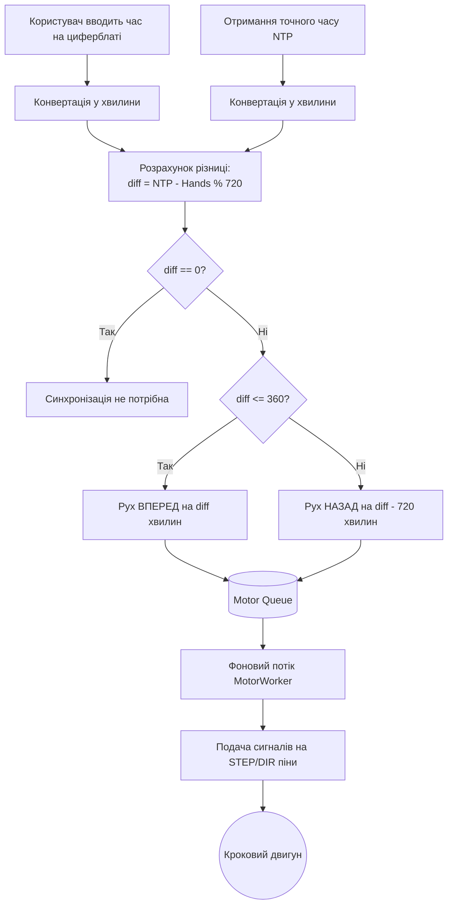
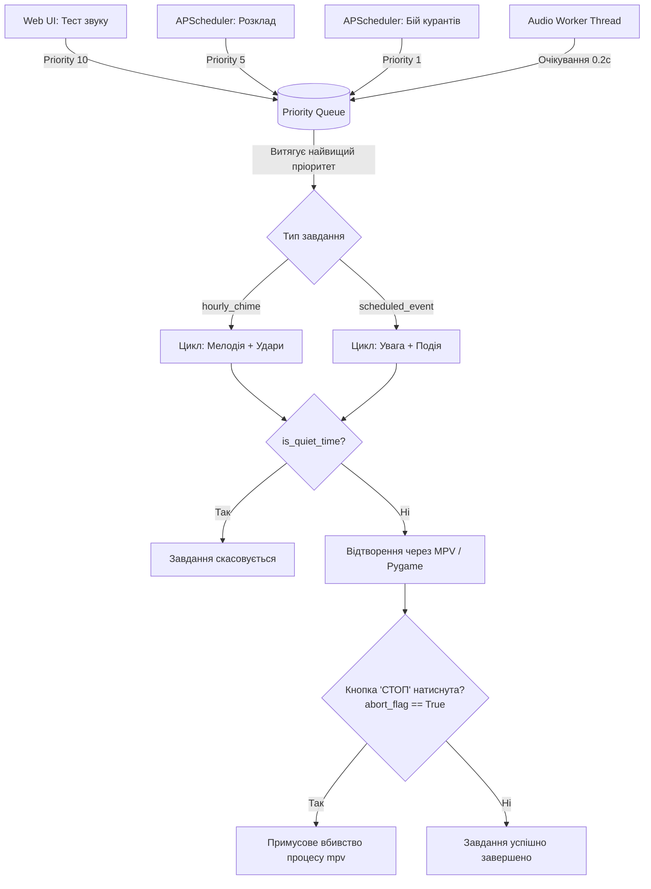
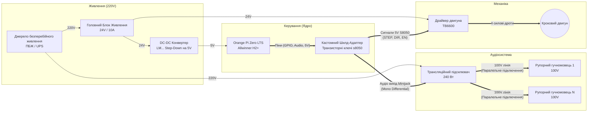
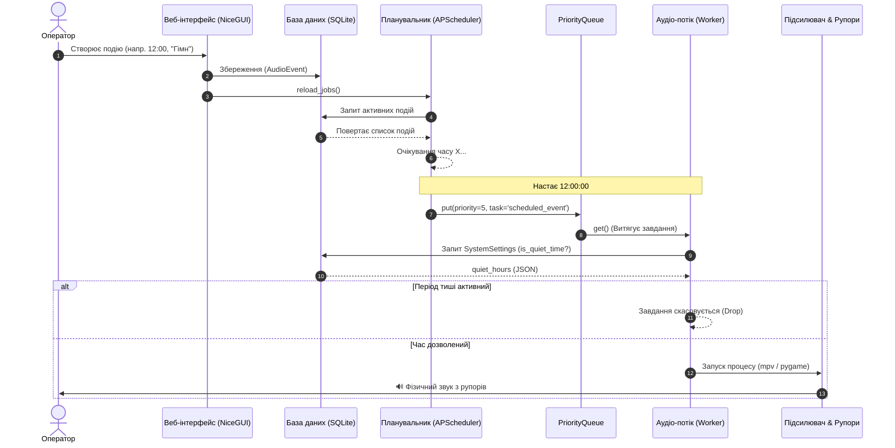
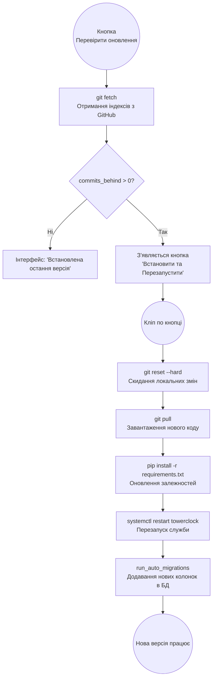
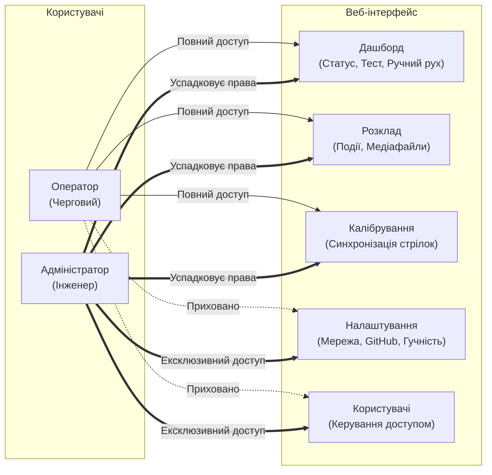
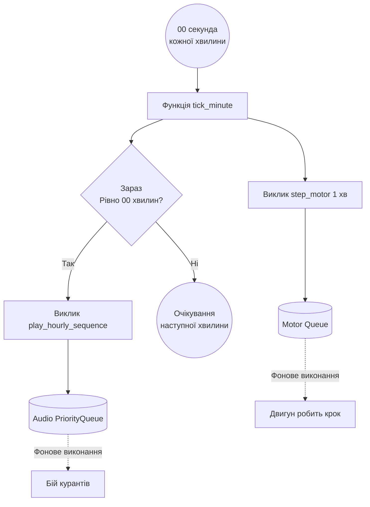

# Відновлення системи годинника КПІ

Система автономного керування баштовим годинником Національного технічного університету України «Київський політехнічний інститут імені Ігоря Сікорського», створена на базі виробничого центру YADRO.

## Основні відомості

### Механіка
* **Мотор:** Nema23 з черв’яковим редуктором
* **Кількість кроків на одну хвилину:** 125
* **Реверс:** Доступний

### Електроніка
* **Мікрокомп’ютер:** OrangePi Zero H2+
* **Прошивка:** Armbian для OrangePi R1 (специфіка чіпа)
* **Програмне забезпечення:** Бібліотека WiringOP та WiringOP-Python

---

## Процес встановлення

### Підготовка обладнання
1. Завантажте образ ОС за посиланням: [Armbian_23.11.1_Orangepi-r1_bookworm_current_6.1.63.img.xz](https://armbian.lv.auroradev.org/archive/orangepi-r1/archive/Armbian_23.11.1_Orangepi-r1_bookworm_current_6.1.63.img.xz).
2. Підготуйте карту пам’яті за допомогою програми **Balena Etcher**: [etcher.balena.io](https://etcher.balena.io/).
3. Вставте карту в мікрокомп’ютер OrangePi Zero H2+.
4. Встановіть мікрокомп’ютер в плату керування та закріпить її в корпусі таким чином, як було (два верхні гвинти вкрутити в кріпильні отвори плати).
   > **УВАГА!** Антена та порти плати й мікрокомп’ютера мають виглядати з відповідного отвору корпусу!
5. Підключіть кабель інтернету та кабель звуку до підсилювача.
6. Подайте живлення на блок керування годинником.

### Ініціалізація ОС
Після запуску системи в локальній мережі КПІ має з’явитись доступ до SSH. У терміналі (cmd / PowerShell / bash) введіть:
```bash
ssh root@10.1.1.250
```
*(Пароль за замовчуванням: `1234`)*

За інструкцією OS проведіть ініціалізацію системи:
* Не змінюйте пароль root, задайте його заново `1234`
* Створіть користувача `orangepi` з паролем `orangepi`.
* Додайте локаль `uk_ua`.
* Визначте регіон: `Europe` -> `Ukraine` -> `most of Ukraine`.
* Перевірте, що часова зона відповідає реальному часу.
* Завершіть сесію root користувача командою `exit` після закінчення ініціалізації.

Почніть нову сесію:
```bash
ssh orangepi@10.1.1.250
```
*(Пароль: `orangepi`)*

Оновіть пакети:
```bash
sudo apt get update
sudo apt get upgrade
```

Увімкніть аудіовихід:
```bash
sudo armbian-config
```
*(Перейдіть: `System` -> `Hardware` -> `analog-codec` (натиснути SPACE щоб з’явилась зірочка) -> `Save`)*

Перезавантажте плату:
```bash
sudo reboot -h now
```

### Встановлення залежностей та WiringOP
За умови успішного перезапуску, за 1–2 хвилини перепідключіться по SSH та встановіть системні пакети:
```bash
sudo apt update
sudo apt install python3-pip python3-venv mpv -y
```

Завантажте та скомпілюйте WiringOP:
```bash
git clone --recursive https://github.com/orangepi-xunlong/wiringOP-Python.git
cd wiringOP-Python
rm -rf wiringOP
git clone --branch master https://github.com/orangepi-xunlong/wiringOP.git
```

Зберіть бібліотеку з правами root:
```bash
su
# Пароль: ваш root пароль (створений під час ініціалізації)
cd /home/orangepi/wiringOP-Python/wiringOP
./build clean
./build
```

> **Перевірка:** Команда `gpio readall` має успішно вивести табличку розпіновки в консолі.

Поверніться до користувача `orangepi` та зберіть Python-обгортку:
```bash
exit
cd ..
sudo apt-get install swig python3-dev python3-setuptools
python3 generate-bindings.py > bindings.i
sudo mkdir -p /etc
sudo sh -c 'echo "BOARD=orangepizero" > /etc/orangepi-release'
sudo python3 setup.py install
```

Якщо не сталось помилок — wiringOP встановлено.

---

## Розгортання проєкту

Копіюємо папку проєкту з git:
```bash
git clone https://github.com/VladislavHolets/TowerClockKPI.git
cd /home/orangepi/TowerClockKPI
```

Для компіляції важких залежностей тимчасово створюємо swap-файл:
```bash
sudo fallocate -l 1G /swapfile
sudo chmod 600 /swapfile
sudo mkswap /swapfile
sudo swapon /swapfile
```

Створюємо віртуальне середовище з доступом до системних пакетів та встановлюємо Python-бібліотеки:
```bash
python3 -m venv --system-site-packages .venv
source .venv/bin/activate
pip install -r requirements.txt
```

> Зачекайте близько 20 хв до встановлення та компіляції залежностей. Може здаватись, що система зависла, але це не так.

Відключаємо та видаляємо допоміжний swap-файл:
```bash
sudo swapoff /swapfile
sudo rm /swapfile
```

---

## Налаштування звуку
Запустіть мікшер:
```bash
alsamixer
```

Налаштуйте гучність каналів `Line Out` та `DAC`. Зніміть Mute (клавіша `M`), щоб з'явилося `00`.
> **УВАГА!** Канал Line Out та DAС може бути відсутній або неактивний, якщо ви забули підключити підсилювач.

Перевірте наявність звуку в динаміках:
```bash
speaker-test -t wav -c 2
```
*(Для зупинки тесту натисніть комбінацію клавіш `Ctrl + C`)*

---

## Налаштування мережі (Wi-Fi Hotspot та пріоритети)
Створіть точку доступу для керування годинником:
```bash
sudo nmcli con add type wifi ifname wlan0 mode ap con-name Hotspot ssid TowerClock
sudo nmcli con modify Hotspot 802-11-wireless.band bg
sudo nmcli con modify Hotspot 802-11-wireless-security.key-mgmt wpa-psk
sudo nmcli con modify Hotspot 802-11-wireless-security.psk clock1234
sudo nmcli con modify Hotspot ipv4.method shared
```

Налаштуйте пріоритети, щоб інтернет працював через кабель:
```bash
# Дізнаємося назву вашого кабельного з'єднання (напр. "Wired connection 1")
nmcli con show
sudo nmcli con modify "Wired connection 1" ipv4.route-metric 100
sudo nmcli con modify Hotspot ipv4.route-metric 200
```

Запустіть мережі:
```bash
sudo nmcli con up "Wired connection 1"
sudo nmcli con up Hotspot
```

---

## Запуск та Автозапуск системи

Перевіряємо функціонал застосунку (якщо ви виходили з сесії):
```bash
cd /home/orangepi/TowerClockKPI
source .venv/bin/activate
```
Якщо ви не виходили з сесії (Venv активований)
```bash
sudo .venv/bin/python run.py
```

Якщо все виконано за інструкцією, на порту 80 з’явиться вікно логіну. 
* **Логін:** `admin`
* **Пароль:** `admin123` (обов’язково змінити в налаштуваннях)

Зупиніть процес комбінацією клавіш `Ctrl + C`.

### Налаштування служби (systemd)
Відкрийте редактор:
```bash
sudo nano /etc/systemd/system/towerclock.service
```

Вставте наступний код:
```ini
[Unit]
Description=Tower Clock Web Server & Motor Control
After=network.target network-online.target

[Service]
Type=simple
User=root
# Вказуємо папку, де лежать наші скрипти, media та settings.yaml
WorkingDirectory=/home/orangepi/TowerClockKPI
# Запускаємо Python прямо з віртуального середовища
ExecStart=/home/orangepi/TowerClockKPI/.venv/bin/python /home/orangepi/TowerClockKPI/run.py
# Автоматичний перезапуск у разі падіння
Restart=always
RestartSec=5

StandardOutput=null
StandardError=journal

[Install]
WantedBy=multi-user.target
```
Збережіть файл (`Ctrl + O` -> `Enter` -> `Ctrl + X`).

Ініціалізуйте автозапуск:
```bash
sudo systemctl daemon-reload
sudo systemctl enable towerclock.service
sudo systemctl start towerclock.service
```
## Діаграми функціонування системи
### 1. Алгоритм роботи Розумного Калібрування (Математика стрілок)

### 2. Архітектура Аудіо Оркестратора (Пріоритети та Безпека)

### 3. Апаратна структурна схема (Hardware Wiring)

### 4.Життєвий цикл події (Sequence Diagram)

### 5.Процес OTA-оновлення "Повітрям" (DevOps Flowchart)

### 6.Модель контролю доступу (RBAC & UI)

### 7.Layered architecture
```mermaid
flowchart TD
    %% Зовнішні актори
    Users(("Користувачі<br>(Оператор / Адмін)"))

    %% Presentation Layer
    subgraph UI ["Шар Інтерфейсу (ui/)"]
        direction TB
        NiceGUI["Фреймворк NiceGUI<br>(Web Server на порту 80)"]
        Auth["login.py<br>(Авторизація та Сесії)"]
        Tabs["Вкладки (tab_*.py)<br>(Дашборд, Розклад, Налаштування)"]
        
        NiceGUI --- Auth
        NiceGUI --- Tabs
    end

    %% Core Layer
    subgraph Core ["Шар Бізнес-логіки (core/)"]
        direction TB
        State["state.py<br>(Глобальний стан годинника)"]
        Sched["scheduler.py<br>(APScheduler: Фоновий планувальник)"]
        Sys["system_control.py<br>(Керування ОС, Wi-Fi, OTA-оновлення)"]
    end

    %% Data Layer
    subgraph DB ["Шар Даних (database/)"]
        direction TB
        CRUD["crud.py<br>(Логіка запитів та Автоміграції)"]
        Models["models.py<br>(ORM Моделі SQLModel)"]
        
        CRUD --- Models
    end

    %% Hardware Layer
    subgraph HW ["Шар Апаратних Драйверів (hardware/)"]
        direction TB
        Audio["audio.py<br>(PriorityQueue + MPV / Pygame)"]
        Motor["motor.py<br>(Queue + WiringPi GPIO)"]
    end

    %% Storage / External
    subgraph Storage ["Файлова Система (storage/ & ОС)"]
        direction LR
        SQLite[("clock.sqlite<br>(База Даних)")]
        Media[("media/<br>(Аудіофайли)")]
        YAML["settings.yaml<br>(Конфіги)"]
    end

    %% Зв'язки
    Users <-->|HTTP / WebSockets| UI
    
    UI -->|Викликає бізнес-логіку| Core
    UI -->|Зберігає/Читає налаштування| DB
    UI -->|[Прямі команди (Тест / Рух)]| HW
    
    Sched -->|Читає розклад подій| DB
    Sched -->|Відправляє завдання в чергу| HW
    
    DB <-->|SQL Запити| SQLite
    HW -->|Відтворення файлів| Media
    Core -.->|Парсинг| YAML
```
### 8.Модель багатопотоковості та черг (Concurrency & Threading)
```mermaid
flowchart TD
    subgraph [Головний потік (Main Thread)]
        UI[NiceGUI Web Server<br>Обробка натискань UI]
    end

    subgraph Потік Планувальника
        Sched[APScheduler Thread<br>Фоновий відлік часу]
    end

    subgraph Безпечні Черги (Thread-Safe)
        MQ[(Motor Queue<br>FIFO черга)]
        AQ[(Audio PriorityQueue<br>Черга з пріоритетами)]
    end

    subgraph Демонічні Потоки-робітники (Daemons)
        MW[MotorWorker Thread<br>Керування GPIO]
        AW[AudioWorker Thread<br>Керування MPV/Pygame]
    end

    %% Взаємодія
    UI -- "Миттєво додає завдання<br>і не чекає виконання" --> MQ
    UI -- "Миттєво додає" --> AQ
    
    Sched -- "Додає тік/події" --> MQ
    Sched -- "Додає звуки" --> AQ

    MQ ==>|Очікування| MW
    AQ ==>|Очікування| AW
    
    MW -->|Блокує тільки свій потік| HardwareMotor((Двигун))
    AW -->|Блокує тільки свій потік| HardwareAudio((Динаміки))
```
### 9."Пульс Вежі" (Хвилинний тік - The Heartbeat)

### 10.Мережева топологія та Режим "Hotspot
```mermaid
flowchart LR
    subgraph [Вежа (Orange Pi)]
        NetworkManager[NetworkManager<br>Служба ОС Linux]
        AP((Wi-Fi Hotspot<br>SSID: TowerClock))
        Web[NiceGUI Server<br>http://10.42.0.1:80]
        
        NetworkManager --> AP
        AP --- Web
    end

    subgraph Користувач
        Device[Смартфон / Ноутбук<br>Оператора]
        Browser[Браузер]
        
        Device -. "Підключення до Wi-Fi<br>(Введення пароля)" .-> AP
        Browser -. "HTTP Запит" .-> Web
    end
```
